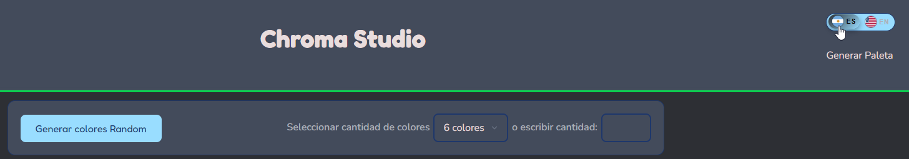
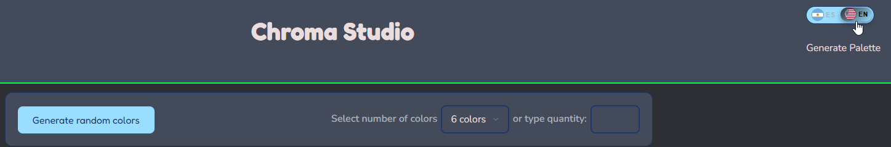
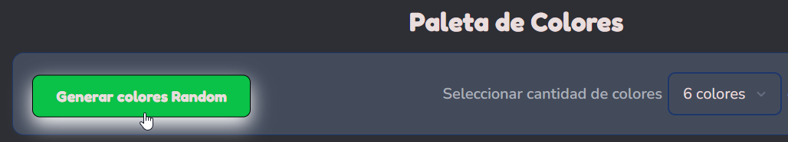
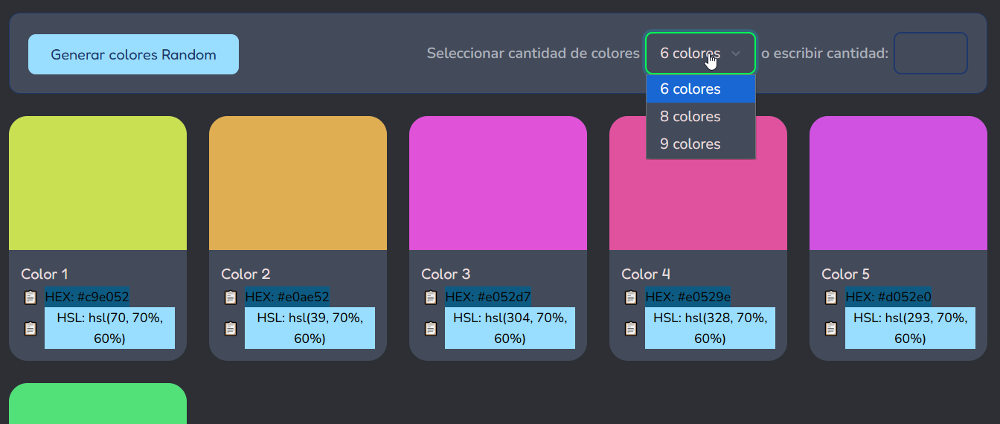
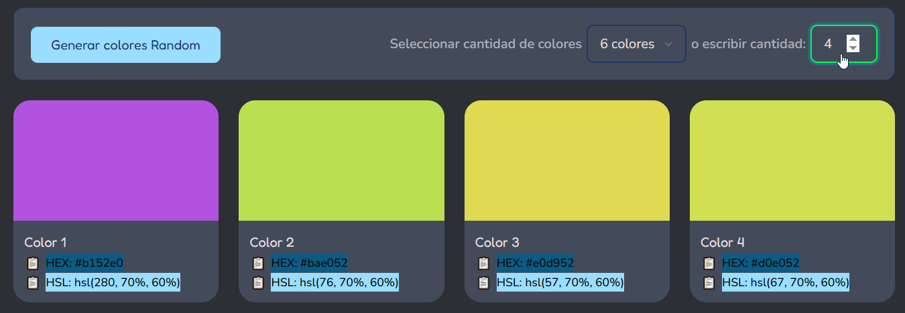
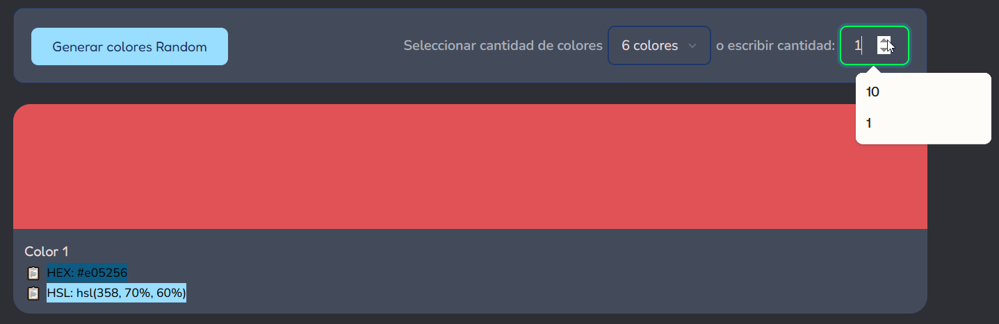
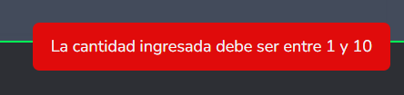
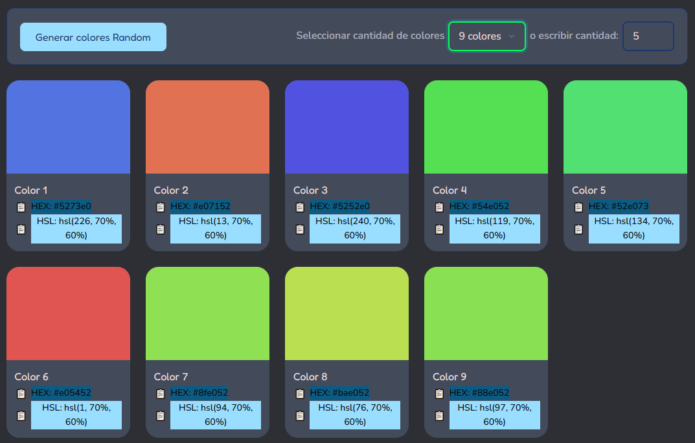
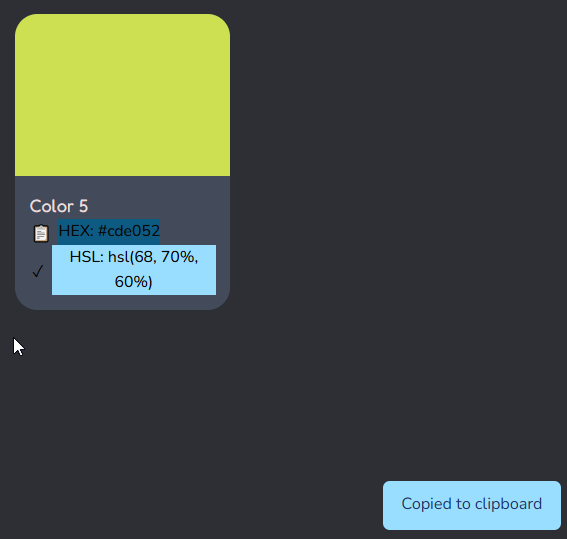

🎨✨ **ChromaStudio – Generador de Paletas de Colores** ✨🎨 

***

# 📁 ChromaStudio – Proyecto M1

ChromaStudio es una aplicación web que permite generar paletas de colores aleatorias de forma rápida, sencilla e intuitiva, ideal para desarrolladores, diseñadores y creadores de contenido que necesitan inspiración cromática. Además cuenta con la posibilidad de cambiar de idioma Español-Ingles 

El usuario puede: 
- Generar una paleta completa con el botón **“Generar colores Random”**. 
- Cambiar la cantidad de colores mediante un **selector** de opciones predefinidas. 
- Especificar manualmente la cantidad de colores que desea generar escribiendo un valor numérico. 
- Visualizar por cada color sus valores en formato **HEX** y **HSL** y tiene la posibilidad de copiarlos en el portapapeles.
- Cambiar de idioma Español/Inglés

***

## 🧩 Tecnologías utilizadas

Este proyecto fue desarrollado utilizando el siguiente stack:

- 🧱 **HTML5** – Estructura semántica de la aplicación. 
- 🎨 **CSS3** – Estilos y diseño visual del sitio. 
- ⚙️ **JavaScript** – Lógica para generar colores aleatorios y actualizar la interfaz. 
- 🌿 **Git** – Control de versiones del proyecto. 
- 🐙 **GitHub** – Hosting del repositorio remoto y colaboración. 
- 🚀 **GitHub Pages** – Despliegue del sitio en producción. 

***

## 🔗 Enlace al proyecto desplegado

Puedes probar la aplicación directamente desde tu navegador en el siguiente enlace:

👉 **ChromaStudio (GitHub Pages):**  
```bash
https://juanmvv.github.io/ProyectoM1_JuanManuelVinuelaOrtiz/ 
```
***


## 🛠️ Cómo ejecutar el proyecto de forma local

A continuación se detalla cómo descargar o clonar el proyecto y ejecutarlo en tu máquina local.

### 1️⃣ Requisitos previos

- Navegador web actualizado (Chrome, Edge, Firefox, etc.). 
- Opcional pero recomendado:  
- **Git** instalado para clonar el repositorio. 
- Algún editor de código (VS Code, por ejemplo). 

***

### 2️⃣ Descargar el proyecto desde GitHub (ZIP)

1. Ingresa al repositorio del proyecto en GitHub 

```bash
https://github.com/JuanMVV/ProyectoM1_JuanManuelVinuelaOrtiz
```

2. Haz clic en el botón **“Code”** y selecciona **“Download ZIP”**.  
3. Descomprime el archivo ZIP en una carpeta de tu preferencia.  
4. Abre la carpeta del proyecto en tu editor o directamente en el explorador de archivos.  
5. Haz doble clic en `index.html` o ábrelo con tu navegador. 

La aplicación se ejecutará localmente y podrás interactuar con el generador de paletas. 

***

### 3️⃣ Clonar el repositorio con Git

1. Asegúrate de tener **Git** instalado. 
2. Abre una terminal o consola (CMD, PowerShell, bash, etc.).  
3. Ejecuta el siguiente comando:

```bash
git clone https://github.com/juanmvv/ProyectoM1_JuanManuelVinuelaOrtiz.git
```

4. Ingresa a la carpeta del proyecto:

```bash
cd ProyectoM1_JuanManuelVinuelaOrtiz
```

5. Abre el archivo `index.html` en tu navegador o arrastra el archivo al navegador. 

***

### 4️⃣ Ejecutar con un servidor local (opcional, recomendado)

Si deseas trabajar de forma más profesional y evitar problemas con rutas relativas, puedes usar un servidor local simple, por ejemplo con **VS Code**:

1. Abre la carpeta del proyecto en **Visual Studio Code**.  
2. Instala la extensión **Live Server**.  
3. Haz clic derecho en `index.html` y selecciona **“Open with Live Server”**.  
4. Se abrirá la aplicación en una URL del tipo `http://127.0.0.1:5500/` en tu navegador. 

***


***

## 📂 Estructura general del proyecto 

La estructura del proyecto, de acuerdo al esquema actual, es:

```bash
ProyectoM1_JuanManuelVinuelaOrtiz/
├── assest/
│   └── img/
│       ├── chromastudio_full_logo.png
│       └── icon-paleta.png
│       └── ...
├── css/
│   └── styles.css
├── js/
│   └── index.js
├── index.html
├── chromaStudio.html
└── README.md
```

- La carpeta `asset/img` contiene los recursos gráficos utilizados en la interfaz (logo principal, ícono de paleta, capturas).  
- La carpeta `css` contiene la hoja de estilos principal `styles.css`.  
- La carpeta `js` contiene la lógica de la aplicación en el archivo `index.js`.  
- `index.html` es el archivo de entrada de la aplicación. 

Esta organización separa la estructura (HTML), los estilos (CSS) y la lógica (JavaScript) para mantener el código limpio y modular. 

***


## 🎛️ Cómo usar la aplicación


- Botón Switch **“AR-EN”** puede elegir en que idioma desea ver la pagina. Español (AR seleccionado) o Inglés (EN seleccionado).





- Botón **“Generar colores Random”** que crea automáticamente una nueva paleta de colores con la cantidad seleccionada. 




- **Selector de cantidad de colores** con opciones predefinidas (por ejemplo, 6, 8, 9 colores), al hacer "click" en alguna opcion se recarga la paleta. 




- Campo numérico para **ingresar manualmente** la cantidad de colores a generar. 




* Se puede tambien utilizar las flechas arriba o abajo para ir cambiando los numeros (solo se permiten números del 1 al 10):




* En caso de que ingrese un numero fuera del rango permitido o en algun formato no válido, no se realiza la operacion y obtiene un mensaje de error:




- Visualización de la paleta, por cada color generado podrá ver: 
  - Título (Color 1, Color 2, etc.). 
  - Código **HEX** (ejemplo: `#c6e052`). 
  - Valor **HSL** (ejemplo: `hsl(0, 96%, 50%)`). 

 


- Puedes usar el botón "📋" para **copiar** con un clic el valor HEX o HSL al portapapeles, notará un mensaje que se copió correctamente y el icono cambiará por **"✔"**

 


**Esta dinámica permite experimentar rápidamente con distintas combinaciones y tamaños de paletas.** 

***

## 🌱 Posibles mejoras futuras

Algunas ideas de extensión para el proyecto:

- Opción para **guardar** paletas favoritas en localStorage. 
- Exportación de paletas en formato JSON o imagen/pdf. 
- Integración con frameworks o librerías de UI para mejorar la experiencia visual. 

***

## 👨‍💻 Autor

**Juan Manuel Viñuela Ortiz** – Alumno de SoyHENRY cursando la carrera de Full Stack Development y entusiasta del desarrollo web.

Siéntete libre de clonar, estudiar, modificar o mejorar este proyecto, y utilizarlo como base para tus propias herramientas de generación de paletas de colores. 