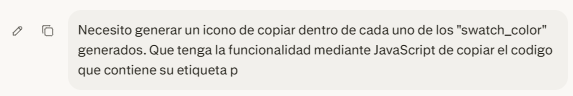
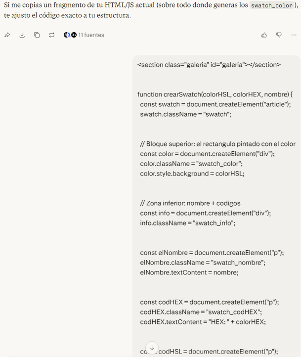
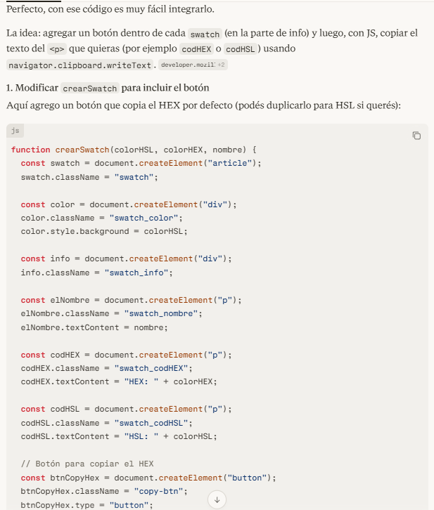
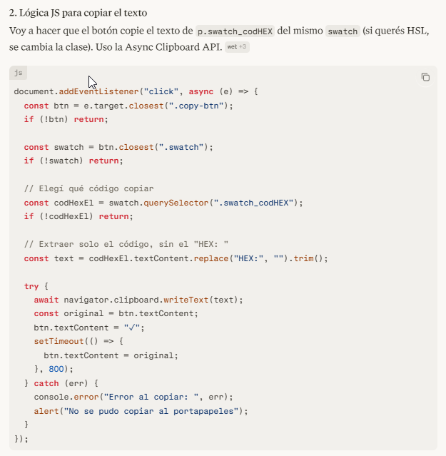
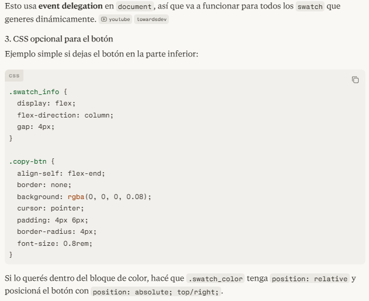
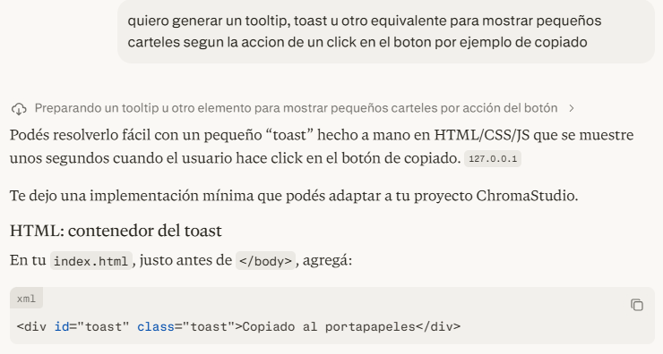
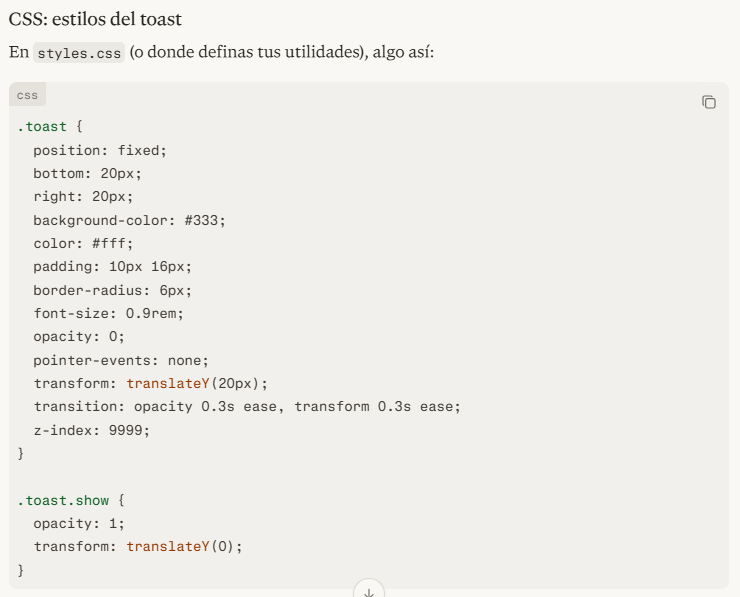
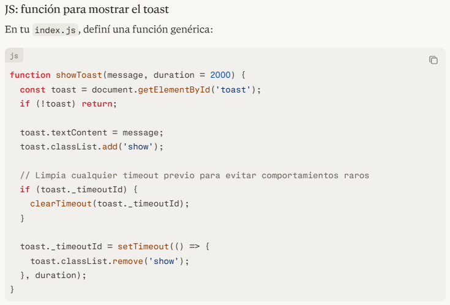

## 🤖 Uso de Inteligencia Artificial

En este proyecto utilicé herramientas de IA para:

- Generar fragmentos de código
- Detectar errores
- Proponer soluciones y mejoras

---

### 🧪 1. Creación de botones para copiar códigos

**Objetivo:** agregar botones que permitan copiar rápidamente los valores HEX y HSL de cada color.

**Prompts utilizados:**

**Propuestas de la IA:**

A partir de estas respuestas, adapté el código sugerido y repliqué la misma lógica para la funcionalidad de copia del valor **HSL**, asegurando consistencia entre ambos formatos.

Además, ajusté los estilos para que encajaran con la paleta y la estructura ya definida en mi archivo `styles.css`.

---

### 🔔 2. Creación de mensajes tipo *toast*

**Objetivo:** mostrar mensajes breves al usuario (éxito y error) al copiar códigos o al producirse alguna validación.

**Prompts y capturas utilizadas:**

Tras evaluar otras alternativas (como tooltips), decidí quedarme con la opción de **toast notifications**, ya que se adaptaba mejor a la estructura visual y al flujo de la aplicación.

Una vez integrada la solución, reutilicé la misma lógica para crear mensajes de error, variando únicamente los estilos según el tipo de mensaje (éxito, error, etc.).

---

### 📄 3. Otras asistencias de IA

También utilicé la IA para:

- Redactar y mejorar secciones de los `README.md`.
- Sugerir estilos y estructura visual de la documentación.
- Recomendar posibles funcionalidades futuras (guardado de paletas, exportación, mejoras de UI, etc).